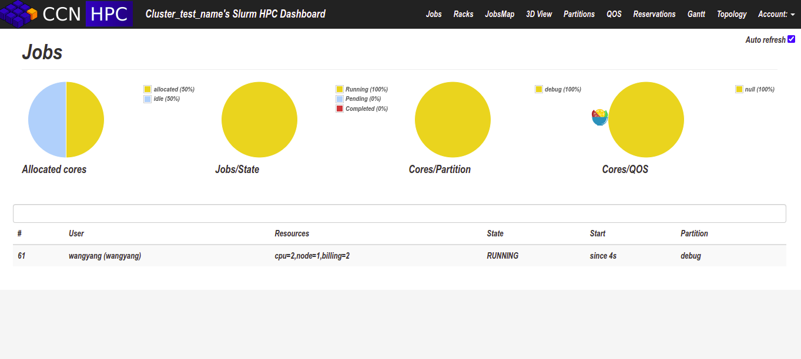

## Slurm-web
本项目是对 https://github.com/edf-hpc/slurm-web 的简化，为了方便部署

## 后台API程序
```
git clone https://github.com/BioinfoFungi/slurm-web.git
cd slurm-web
pip install .
python -m slurmweb.restapi.slurmrestapi
```

## 前台web页面
```
cd slurm-web/dashboard
python -m http.server
```

## 访问浏览器
<http://localhost:8000/>



## PySlurm安装
```
git clone https://github.com/PySlurm/pyslurm.git
python setup.py build --slurm-inc=/usr/include/slurm-wlm --slurm-lib=/usr/lib/x86_64-linux-gnu/
```
> <https://github.com/PySlurm/pyslurm/issues/120>
> <https://github.com/PySlurm/pyslurm>

## 更新日志
#### 2022.8.6
将项目跑起来，没有实现权限管理。已经测试测试安装好slurm，就可以在网页查看job的信息。
